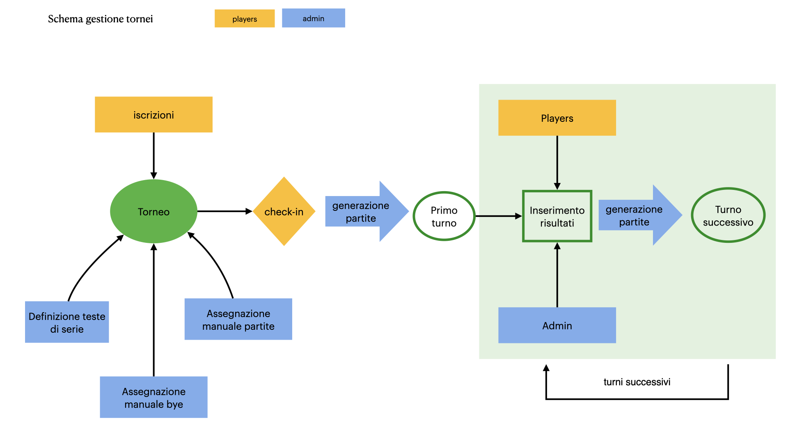
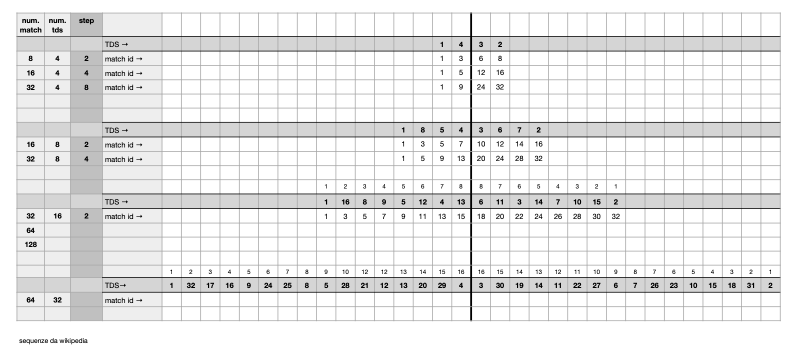
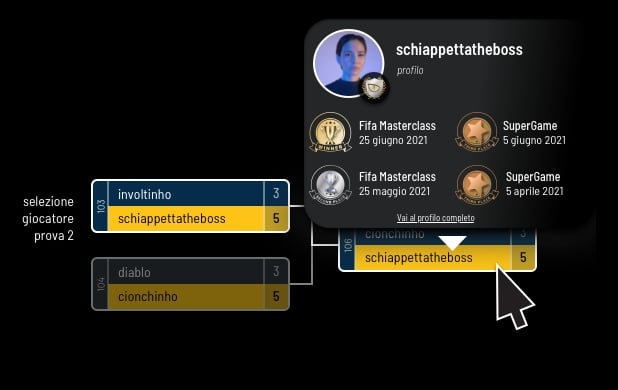

# Specifiche gestione tornei e brackets (front-end)

v.1 Ott 2021

## Numero giocatori per torneo

Il numero dei giocatori che parteciperanno ai tornei deve essere sempre una potenza di 2 (8, 16, 32, 64…). Se gli iscritti non raggiungono il numero richiesto, la differenza corrisponderà ad altrettanti bye.

## Check-in
Se attivato nella scheda di configurazione del torneo, i giocatori dovranno effettuare un check-in sul sito dei tornei per confermare la loro presenza.

L'operazione avrà luogo prima dell'avvio della composizione del bracket (primo turno).

La presenza o meno del check-in sarà configurabile lato admin nella scheda di gestione del torneo
Il check-in partirà da una data e ora prefissate e a quel punto i giocatori avranno un limite di tempo per confermare la loro presenza.

Tutti questi parametri saranno configurabili dalla scheda del torneo (con valori di default da gestire nelle preferenze).

Se entro la scadenza prefissata un giocatore non avrà effettuato il check-in, la sua iscrizione sarà annullata.

Il numero di partite del primo round verrà quindi calcolato sulla base dei soli iscritti confermati.

## Composizione partite primo turno / bye / teste di serie

Una volta terminata la raccolta delle iscrizioni e degli eventuali check-in, lato admin sarà possibile comporre le partire del primo turno in base al seguente meccanismo:

* le partite saranno composte associando le teste di serie con gli altri giocatori, selezionati in modo random, secondo uno schema di questo tipo:

* Le **teste di serie** potranno essere definite manualmente o ricavate in modo automatico sulla base del ranking dei giocatori
* Il loro numero sarà di default di 8 unità, ma potrà essere variato torneo per torneo secondo uno di questi valori: 0, 8, 16, 32
* La sequenza gerarchica delle teste di serie sarà ricavata in base al ranking ma potrà essere modificata con un meccanismo a trascinamento
* Il ranking considerato sarà sempre quello della stagione in corso
* Una volta composte le partite delle teste di serie, gli altri match verranno definiti in modo totalmente random
* Le teste di serie, di default, non verranno evidenziate nel tabellone, ma sarà possibile attivare questa opzione torneo per torneo.
* I **bye** verranno assegnati prima della composizione dei match assegnandoli ai giocatori più in alto nella sequenza teste di serie/ranking
* Sarà comunque possibile assegnare manualmente uno o più bye (tra quelli disponibili)
* Sarà inoltre possibile definire manualmente i giocatori di uno o più match
* Una volta impostati i vari criteri, la composizione delle partite del primo round sarà avviata manualmente lato admin.

Una volta generata la serie delle partite, non sarà possibile modificarla (sarà però possibile vederne un'anteprima prima di dare il comando di avvio della procedura)

## Registrazione dei risultati / round successivi

I risultati delle partite saranno inseriti lato admin.

Sarà però possibile inserire i risultati anche da parte dei player, con i seguenti criteri:

* L'inserimento avverrà tramite accesso alla propria area riservata (mel sito tornei) nella quale sarà presente una sezione ad hoc. La sezione sarà presente e/o abilitata solo se l'utente ha dei tornei in corso
* I giocatori dovranno inserire il risultato e uno screenshot che lo documenti
* Il risultato deve essere convalidato da entrambi i giocatori entro un limite di tempo prefissato
* Se uno dei due giocatori non convalida il risultato, o in caso di di contraddittori, l'esito della partita dovrà essere validato lato admin.
* Una volta che l'inserimento dei risultati permetterà la composizione dei match dei round successivi, questi potranno essere immediatamente giocati, ripetendo il ciclo fino al completamento di tutti i round

Saranno possibili tornei con match del tipo *Best of Three* (attivabili dalla scheda torneo in admin) in cui l'inserimento dei risultati preveda la presenza di più partite. In questo caso la vittoria verrà assegnata a chi avrà vinto il maggior numero di partite e nel bracket il punteggio riportato corrisponderà al numero di partite vinte
Non saranno possibili casi di parità.

## Assegnazione punteggi e definizione vincitori

L'assegnazione dei punti ranking e badge, e del primo e secondo posto verranno eseguite automaticamente. Ai perdenti della semifinale verrà assegnato il terzo posto ex-aequo.

## Annullamento risultati

Lo staff potrà in qualsiasi momento del torneo annullare una partita e, conseguentemente, tutte quelle derivate dal risultato interessato.

Una volta eseguita, questa operazione non sarà annullabile.

Sarà cura dello staff ricomporre le parti interessate del tabellone e far rigiocare le partire interessate.

## Rappresentazione grafica brackets

La resa grafica dei brackets sarà analoga a quella mostrata nelle immagini seguenti (piccole variazioni potranno essere apportate in fase di realizzazione dell'esecutivo).

Facendo clic su un giocatore, verranno evidenziate le partite giocate nel torneo e verrà mostrata una piccola finestra di informazioni aggiuntive:

